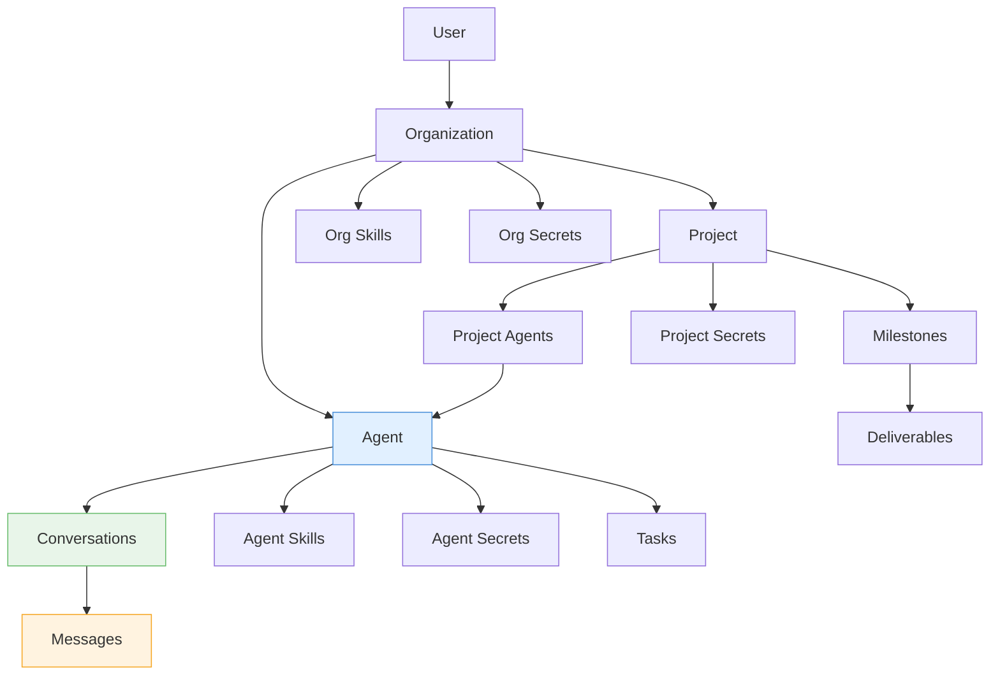
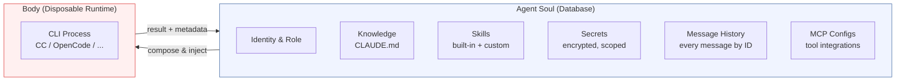
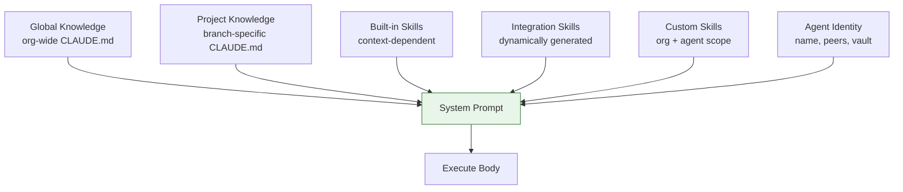
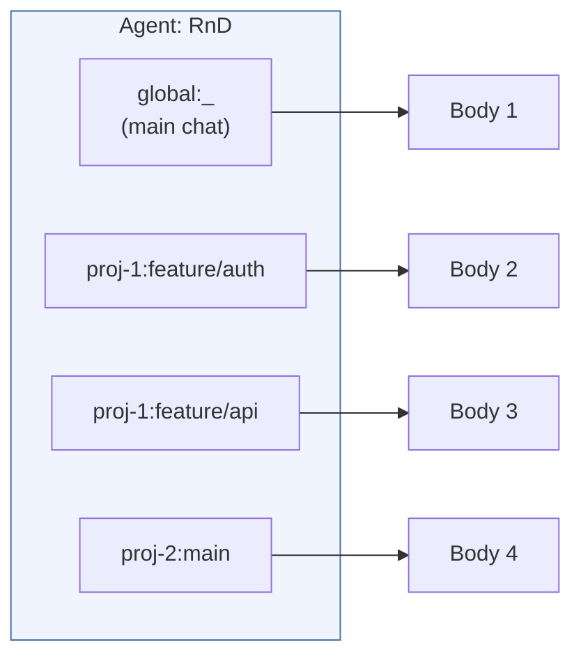
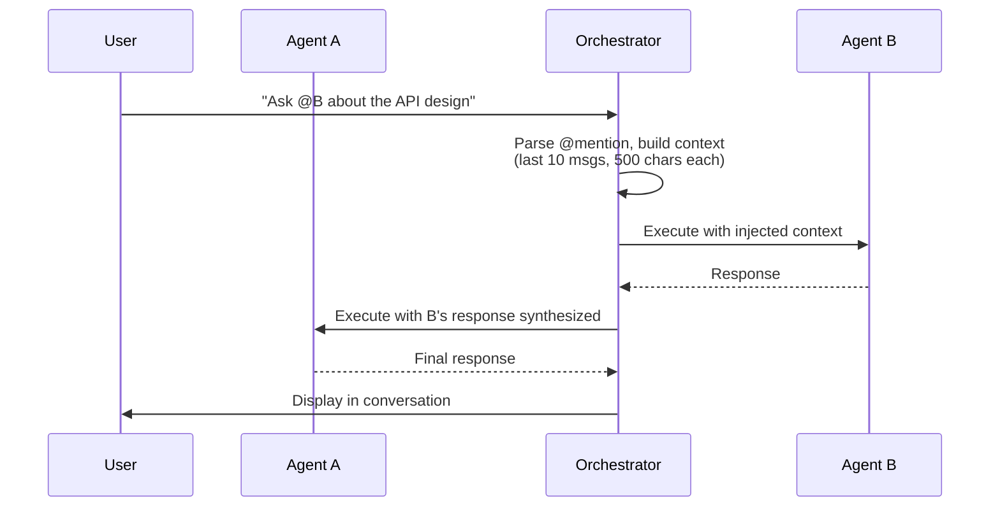
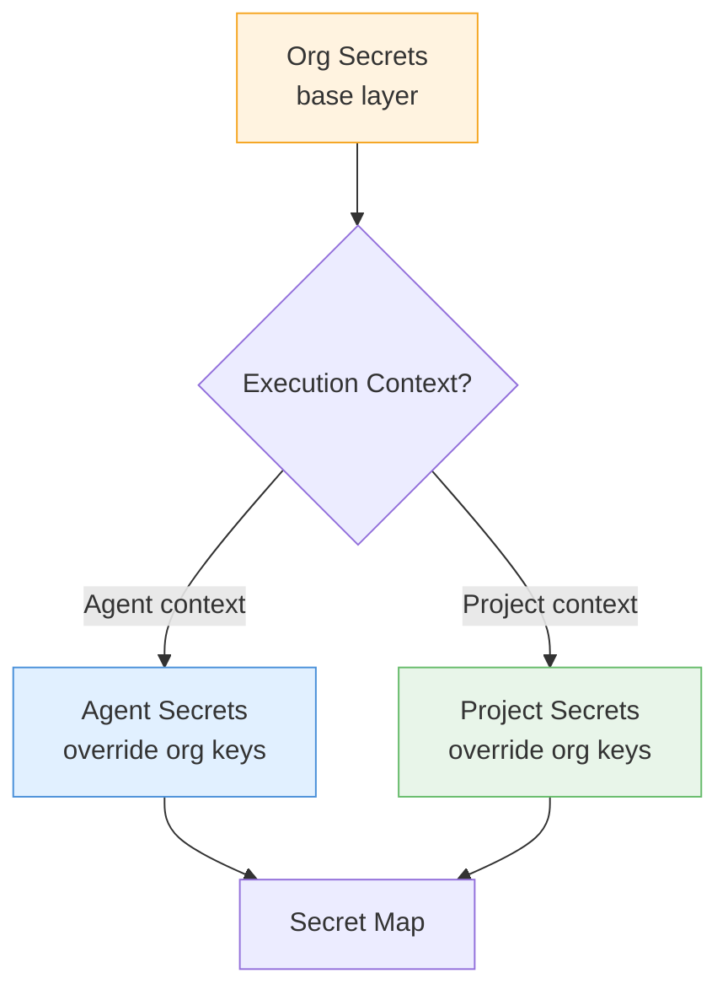
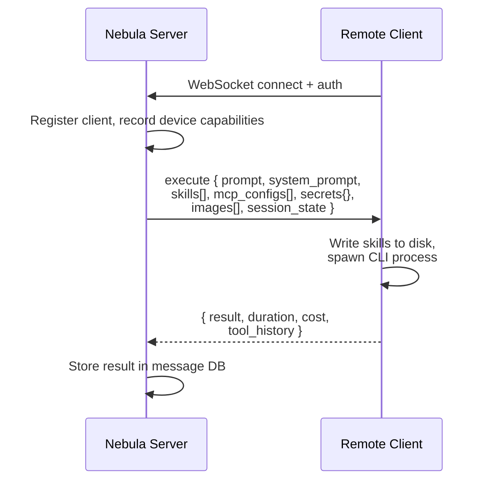

# Nebula: Decoupling Agent Identity from Runtime in Multi-Agent LLM Systems

**Abstract**

As LLM-based agents move from single-session tools to persistent, collaborative systems, a fundamental architectural question arises: who owns the agent's state? In most existing frameworks, the execution runtime (a CLI process, an API client, or an in-memory object) owns the conversation history, and the orchestration layer has limited visibility into or control over individual messages. This paper describes Nebula, an open-source multi-agent platform that inverts this relationship by storing all agent state — messages, skills, knowledge, and credentials — in a normalized relational database, separate from any execution runtime. We formalize this as a *soul/body separation*, where the soul (persistent identity) is composed into context-appropriate prompts and injected into disposable runtime processes (bodies) at each execution. We describe the architectural patterns this separation enables, report quantitative results from a production deployment (7 agents, 234 executions, 17 scheduled tasks over 5 days), and discuss the trade-offs involved.

---

## 1. Introduction

### 1.1 The Problem

The current generation of LLM coding agents — Claude Code [1], Aider [2], Cursor [3], OpenHands [4] — are effective single-agent tools. A user interacts with one agent in one session, and the agent maintains its own conversation state internally. This model breaks down when we want:

- **Multiple agents** collaborating on different aspects of the same project
- **Persistent agents** that survive infrastructure failures (container restarts, session eviction)
- **Context-dependent behavior** where the same agent operates differently depending on what it is working on
- **Inter-agent communication** where agents can request help from peers without pre-configured workflows

These requirements arise naturally in organizational settings where AI agents take on specialized roles (engineering, marketing, operations) and need to coordinate.

### 1.2 Observation

In all of the above scenarios, the underlying issue is the same: **the execution runtime owns the agent's state, and the orchestration layer cannot inspect, compose, or route it**. If the runtime's session file is lost, the conversation is gone. If two agents need to exchange context, there is no shared representation to draw from. If an agent needs different capabilities in different projects, there is no mechanism to swap them without reconfiguring the runtime.

### 1.3 Approach

Nebula separates agent *identity* from agent *execution*:

- The **soul** is the agent's persistent identity — its name, role, accumulated knowledge, skills, credentials, and complete message history — stored in a relational database.
- The **body** is a disposable CLI process that receives a context-appropriate subset of the soul at spawn time, executes a task, and returns.

This is not a novel concept in distributed systems — the separation of state from compute is well-established. Our contribution is applying it to LLM agent orchestration and documenting the architectural patterns it enables, the trade-offs it introduces, and empirical observations from production use.

---

## 2. Related Work

**In-memory agent frameworks.** LangChain [5], AutoGen [6], and CrewAI [7] provide multi-agent abstractions but store agent state in Python objects. Agent identity does not survive process restarts, and inter-agent communication requires explicit wiring (group chats, pub-sub buses). MetaGPT [8] introduces role-based agents with a shared message pool but does not persist state across sessions.

**Agent orchestration platforms.** OpenHands [4] provides sandboxed environments for coding agents but focuses on single-agent execution without inter-agent routing. Workflow engines (Windmill, n8n, Temporal) orchestrate tasks via pre-defined DAGs, which are effective for known workflows but cannot adapt to the ad-hoc coordination patterns that emerge in agent collaboration.

**CLI coding agents.** Claude Code [1], Aider [2], and Cursor [3] manage their own session state (conversation files, session IDs). They are designed as single-user tools and provide no API for external orchestration, message routing, or dynamic capability injection. Nebula treats these tools as interchangeable execution runtimes rather than complete solutions.

**Actor model and agent communication.** The Actor model [9] and FIPA-ACL [10] provide theoretical foundations for message-passing concurrency. Nebula's @mention routing shares conceptual lineage but operates at the natural language level — messages are human-readable text, not structured protocols — prioritizing inspectability and debuggability over formal verification.

---

## 3. Architecture

### 3.1 Overview

Nebula is a single-container application (Node.js, Express, React, SQLite) that manages multiple agents within user-scoped organizations. The core data model:



Each message is stored as an individually addressable database row with its own ID, role, content, type classification, and metadata (execution duration, cost, tool history). This granularity — rather than storing conversations as opaque blobs — is what enables the routing, recovery, and composition patterns described below.

### 3.2 Soul: Persistent Agent Identity

An agent's soul comprises six components, all stored outside any runtime process:



The soul is never modified by the runtime directly. The runtime receives a read-only projection of the soul (the composed system prompt) and returns structured output (result text, cost, tool invocations) that the orchestrator writes back to the soul's message history.

### 3.3 Body: Disposable Runtime Execution

A body is a short-lived process that implements a common execution interface:

```
execute({ prompt, systemPrompt, agentDir, conversation, options })
    → { result, duration_ms, total_cost_usd, usage, tool_history }
```

The orchestrator currently supports two runtimes (Claude Code CLI and OpenCode) and a WebSocket bridge for remote execution. Adding a new runtime requires implementing this interface — the soul's composition pipeline is runtime-agnostic.

---

## 4. Architectural Patterns

### 4.1 Dynamic Context Composition

At each execution, the orchestrator assembles a system prompt from the soul's components, filtered by execution context:



The composition is **not cached** — it is regenerated per execution. A skill update, secret rotation, or project reassignment takes effect on the next execution without any restart or cache invalidation.

**Secret interpolation across trust boundaries.** Skills reference credentials using `{{KEY}}` template syntax. The resolver applies different strategies depending on the consumer:

Let `S` be a skill template containing placeholder `{{K}}`, and let `\sigma(K)` be the decrypted value of secret `K`. The resolution function $R$ differs by target:

$$R_{\text{skill}}(S, K) = S\left[{{K}} \to \$\{K\}\right]$$

$$R_{\text{mcp}}(S, K) = S\left[{{K}} \to \sigma(K)\right]$$

The agent sees environment variable references (`${K}`), never plaintext values. MCP server processes — which are trusted executables, not LLM-controlled — receive the actual credentials. This creates a security boundary: agents can *invoke* credentialed tools but cannot *read* the credentials themselves.

### 4.2 Context-Keyed Concurrent Execution

A single agent can execute simultaneously across multiple contexts. The execution queue is partitioned by a three-dimensional key:

$$\text{contextKey}(a, p, b) = a \mathbin{\|} p \mathbin{\|} b$$

where $a$ is the agent ID, $p$ is the project ID (or `global`), and $b$ is the branch name (or `_`).



**Serialization rule:** Jobs with the same context key are serialized (queued). Jobs with different keys execute in parallel, subject to a per-agent concurrency cap per project.

**Isolation mechanism:** Each context maps to a distinct git worktree, providing filesystem-level isolation between concurrent bodies. Knowledge conflicts (e.g., two branches modifying CLAUDE.md) are deferred to git merge — the same mechanism developers use for concurrent code changes.

### 4.3 Message-Driven Inter-Agent Routing

Inter-agent communication uses two natural-language routing primitives embedded in message content:

**@mention (synchronous).** When a message contains `@AgentName`:



The orchestrator builds a context window from the originating conversation (last 10 messages, filtered to exclude error/system noise), executes the mentioned agent in its own session, then passes the response back to the originating agent. The originating agent's execution is deferred until all mentioned agents complete.

**@notify (asynchronous).** `@notify AgentName` pushes a notification to the target agent's own conversation with lower queue priority. The sender does not wait.

**Recursive routing.** After any execution, the orchestrator re-scans the response for @mention patterns and dispatches recursively, enabling multi-hop workflows without explicit configuration.

**Emergent topology.** Unlike DAG-based systems where the workflow graph is declared in advance, the coordination pattern emerges from agents' natural language decisions about whom to mention. The orchestrator provides routing infrastructure; agents determine the topology.

### 4.4 Session Continuity

Because the orchestrator owns all messages, session recovery does not depend on the runtime's internal state. When a CLI session is lost (container restart, eviction, branch change), the orchestrator:

1. Detects the failure (runtime reports "session not found")
2. Queries the conversation's message history from the database
3. Constructs a recovery preamble (recent messages, filtered for noise, within a configurable token budget)
4. Retries execution with the preamble prepended to the new prompt

The recovery budget is a tunable parameter, not a hard limitation — the database contains the complete history. The current default (10,000 tokens) reflects a practical trade-off between context completeness and prompt size, but full-history recovery is architecturally possible.

**Branch change handling.** When an agent's assigned deliverable changes branches, the orchestrator detects the mismatch between the conversation's `session_branch` and the new execution context, resets the session, and injects recovery context automatically.

### 4.5 Scoped Secret Resolution

Credentials are stored at three scopes with context-dependent resolution:



Agent and project secrets are **sibling scopes**, not a hierarchy. An agent executing in project context receives org + project secrets; in agent context, org + agent secrets. This prevents credential leakage across project boundaries — the same agent assigned to two projects receives different credentials depending on which project it is currently executing in.

### 4.6 Remote Agent Bridging

Agents can execute on external machines via a WebSocket bridge. The protocol transfers the complete execution context per request:



The system prompt and skills are regenerated and sent fresh with every request — no caching, no synchronization protocol, no stale state. This simplifies the protocol at the cost of bandwidth (system prompts range 20–100KB), a trade-off that is acceptable for the execution frequencies observed in practice.

---

## 5. Multi-Agent Coordination via Projects

### 5.1 Role-Based Capability Injection

When agents are assigned to a project, each receives a role (coordinator or contributor) that determines which skills are injected at execution time:

| Aspect | Coordinator | Contributor |
|--------|------------|-------------|
| Visibility | All deliverables, all team members | Own deliverables only |
| Skills injected | Project management, readiness evaluation, PR review | Branch work, deliverable status, PR creation |
| Autonomy directive | "Push forward, only stop for decisions/blockers" | Follow assignment, submit for review |
| Post-mention behavior | Receives synthesis of all contributor responses | N/A |

The same agent can be coordinator on one project and contributor on another, receiving different capabilities depending on context. This is a consequence of the soul/body separation: the soul defines *who the agent is*, but the orchestrator determines *what it can do* at each execution.

### 5.2 Concurrent Branch Development

Each deliverable maps to a git branch and a worktree:

$$\text{workdir}(a, p, b) = \texttt{/data/orgs/\{orgId\}/agents/\{a\}/projects/\{p\}/\{b\}/}$$

This yields per-branch isolation with no shared mutable state between concurrent executions. The same agent working on three branches spawns three independent bodies, each in its own worktree, with its own CLI session.

Knowledge evolution is handled by git itself: each branch's CLAUDE.md is a versioned file. When branches merge, knowledge merges. Conflicts are resolved by the coordinator as part of PR review — no custom conflict resolution protocol is needed.

### 5.3 Readiness as a Live Invariant

Projects implement readiness as a function evaluated on demand, not a static flag:

$$\text{ready}(p) = \bigwedge_{c \in \text{SystemChecks}(p)} c.\text{met} \;\wedge\; \bigwedge_{c \in \text{AgentChecks}(p)} c.\text{met}$$

System checks are mechanically derived (git remote configured, specs exist in vault, milestones have deliverables). Agent checks are user-declared prerequisites. If $\text{ready}(p)$ transitions from true to false while the project is active, the system auto-demotes to `not_ready`. Promotion to active requires explicit user confirmation — a one-way safety valve.

---

## 6. Quantitative Observations

The following data is drawn from a production Nebula deployment running on a Synology DS925+ NAS, observed over 5 days (2026-03-21 to 2026-03-25).

### 6.1 Deployment Summary

| Metric | Value |
|--------|-------|
| Agents | 7 |
| Conversations | 12 |
| Total messages | 463 |
| Total executions | 234 |
| Scheduled tasks | 17 (cron + webhook) |
| Custom skills | 11 |
| Org secrets | 7 |
| Projects | 1 (with 3 milestones, 12 deliverables) |

### 6.2 Execution Profile

| Metric | Value |
|--------|-------|
| Total execution time | 413.1 minutes (~6.9 hours) |
| Total tokens consumed | 799,550 (81K in, 718K out) |
| Total cost | $172.51 |
| Success rate | 91.0% (213/234) |
| Avg. tokens per execution (in) | 347 |
| Avg. tokens per execution (out) | 3,070 |
| Session recoveries triggered | 3 |

### 6.3 Per-Agent Distribution

| Agent | Role | Executions | Cost ($) | Time (min) | Avg. Duration (s) |
|-------|------|-----------|----------|-----------|-------------------|
| RnD | Engineering | 129 | 105.06 | 222.6 | 103.5 |
| Secretary | Operations | 52 | 38.82 | 90.9 | 104.8 |
| Marketing | Marketing | 20 | 15.24 | 41.0 | 123.1 |
| Monetization | Strategy | 18 | 11.98 | 50.7 | 169.1 |
| BM Pacman | Remote (Windows) | 8 | 0.76 | 4.4 | 33.3 |
| Finance | Compliance | 4 | 0.24 | 1.4 | 20.6 |
| Mac M3 Max | Remote (macOS) | 3 | 0.41 | 2.0 | 41.0 |

The distribution shows significant variance in agent utilization, reflecting the organizational reality: the engineering agent handles the majority of interactive development work, while specialized agents (Finance, Marketing) execute primarily via scheduled tasks.

### 6.4 Execution Volume by Day

| Date | Executions | Cost ($) |
|------|-----------|----------|
| 2026-03-21 | 8 | 4.69 |
| 2026-03-22 | 84 | 69.07 |
| 2026-03-23 | 58 | 40.94 |
| 2026-03-24 | 47 | 28.86 |
| 2026-03-25 | 37 | 28.95 |

Day 2 (March 22) shows peak activity corresponding to the initial project setup phase, where the coordinator agent dispatched work to multiple contributors.

### 6.5 Model Usage

| Model | Executions | Tokens In | Tokens Out | Cost ($) |
|-------|-----------|-----------|-----------|----------|
| claude-opus-4-6 | 181 | 33,579 | 506,759 | 143.88 |
| claude-sonnet-4-6 | 53 | 47,699 | 211,513 | 28.63 |

The higher token-in count for Sonnet reflects its use for scheduled tasks, which include larger system prompts with task context. Opus handles the majority of interactive development with higher per-token cost but more concise input prompts.

### 6.6 Message Composition

| Category | Count | % |
|----------|-------|---|
| User messages | 225 | 48.6% |
| Assistant responses | 238 | 51.4% |
| Chat messages | 331 | 71.5% |
| Task-triggered messages | 98 | 21.2% |
| Inter-agent messages | 9 | 1.9% |
| Error messages | 25 | 5.4% |
| Avg. user message length | 774 chars | — |
| Avg. assistant message length | 1,725 chars | — |

Task-triggered messages (21.2%) demonstrate autonomous operation — agents executing scheduled work without user interaction. Inter-agent messages, while a small fraction of total volume, represent coordination events where one agent explicitly routed work to another.

### 6.7 Scheduled Task Configuration

The 17 scheduled tasks span 5 agents:

| Pattern | Tasks | Agents |
|---------|-------|--------|
| Morning/Evening scan (daily) | 6 | RnD, Marketing, Monetization |
| Weekly memo (Wednesday) | 3 | RnD, Marketing, Monetization |
| Morning/Evening briefing (daily) | 2 | Secretary |
| Weekly summary (Friday) | 1 | Secretary |
| Weekly blog proposal (Friday) | 1 | Secretary |
| Monthly compliance check | 1 | Finance |
| Quarterly document review | 1 | Finance |
| On-demand webhook | 1 | BM Pacman |
| Auto-worker (disabled) | 1 | RnD |

This demonstrates agents operating on different time scales — from sub-daily operational scans to quarterly compliance reviews — using the same cron infrastructure.

### 6.8 Project Coordination

The single active project (Nebula Web) involves 4 agents:

| Agent | Role | Deliverables Completed |
|-------|------|----------------------|
| RnD | Coordinator | — (manages all) |
| Marketing | Contributor | assigned |
| Monetization | Contributor | assigned |
| Secretary | Contributor | assigned |

All 12 deliverables across 3 milestones have reached `done` status, each backed by a feature branch and git worktree.

---

## 7. Discussion

### 7.1 What the Separation Enables

The soul/body separation is not interesting in itself — it is a well-known pattern (stateless compute, externalized state). What is worth examining is the specific capabilities it enables in the LLM agent context:

**Granular message routing.** Because every message is an addressable database row (not buried in a session file), the orchestrator can build arbitrary context windows — last N messages from conversation A, inject into agent B's execution, store B's response in conversation A. This is the mechanism behind @mention routing, and it requires no cooperation from the runtime.

**Non-destructive context switching.** An agent can work on project A, switch to project B, and return to project A without losing context in either. The orchestrator maintains separate conversations (with separate session IDs and branch tracking) per context, and the runtime does not need to know about the others.

**Runtime portability.** When the soul is external, switching from one CLI tool to another is a configuration change, not a migration. The agent's message history, skills, and knowledge persist regardless of which runtime executes the next prompt.

### 7.2 Trade-offs

**Prompt size.** Dynamic context composition produces system prompts that range from 20KB to 100KB, depending on the number of skills, peer agents, and project context. This is workable with current large-context models but may become a concern as the number of skills grows. Prompt compression or skill summarization could mitigate this.

**Single-instance storage.** The current SQLite implementation is appropriate for single-instance deployment but does not scale horizontally. The architectural principles — soul/body separation, context-keyed queuing, scoped secrets — are not inherently tied to SQLite and could be implemented on a distributed store.

**Context key correctness.** The per-context serialization model depends on correct construction of the `contextKey(a, p, b)` triplet. An error in key generation could allow concurrent execution within the same worktree. The current implementation has not exhibited this failure, but it is not formally verified.

**Recovery fidelity vs. cost.** Session recovery injects historical messages into the new prompt, consuming tokens. The default budget (10,000 tokens) was chosen empirically. Full-history recovery is possible but expensive — a conversation with 174 messages (our longest) would consume significant context window space. The right budget depends on the use case.

### 7.3 Observations from Production Use

Several patterns emerged that were not part of the initial design:

**Agents develop distinct communication styles.** Despite sharing the same underlying model, agents with different role descriptions produce noticeably different output. The Secretary agent writes formal briefings; the RnD agent writes technical analysis. This is a consequence of role injection, not fine-tuning.

**Scheduled tasks create organizational rhythm.** Morning scans, evening briefings, and weekly memos give the agent team a cadence that mirrors human organizational patterns. The Secretary's Friday blog proposal is synthesized from the week's activity across all agents.

**Error rates vary by agent role.** The overall 91% success rate masks significant per-role variance. Agents performing complex multi-tool tasks (RnD) experience more errors than those performing information synthesis (Secretary). This suggests that error handling strategies should be role-aware.

---

## 8. Conclusion

This paper describes an architectural pattern — separating agent identity from execution runtime — and documents the capabilities it enables for multi-agent LLM systems. The core mechanism is straightforward: store agent state in a database, compose context-appropriate prompts at each execution, and treat runtime processes as disposable.

The resulting system supports concurrent multi-context execution, transparent session recovery, message-driven inter-agent routing, and runtime-agnostic deployment — capabilities that are difficult to achieve when the runtime owns the agent's state.

We release Nebula as open-source software. The patterns described here are not specific to our implementation; they could be applied to any multi-agent system where long-running, persistent agent operation is desired.

---

## References

[1] Anthropic. "Claude Code." https://docs.anthropic.com/en/docs/claude-code, 2024.

[2] Gauthier, P. "Aider: AI pair programming in your terminal." https://github.com/paul-gauthier/aider, 2023.

[3] Cursor. https://cursor.sh, 2023.

[4] Wang, X., et al. "OpenDevin: An Open Platform for AI Software Developers as Generalist Agents." arXiv:2407.16741, 2024.

[5] Chase, H. "LangChain." https://github.com/langchain-ai/langchain, 2022.

[6] Wu, Q., et al. "AutoGen: Enabling Next-Gen LLM Applications via Multi-Agent Conversation." arXiv:2308.08155, 2023.

[7] Moura, J. "CrewAI." https://github.com/joaomdmoura/crewAI, 2024.

[8] Hong, S., et al. "MetaGPT: Meta Programming for A Multi-Agent Collaborative Framework." arXiv:2308.00352, 2023.

[9] Hewitt, C., Bishop, P., Steiger, R. "A Universal Modular ACTOR Formalism for Artificial Intelligence." IJCAI, 1973.

[10] FIPA. "FIPA ACL Message Structure Specification." Foundation for Intelligent Physical Agents, 2002.
